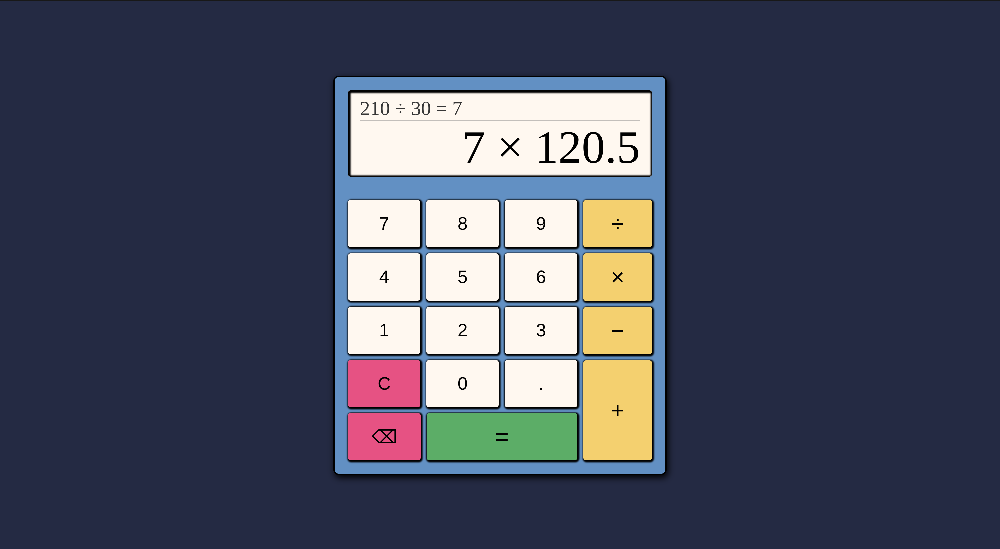

# Project: Calculator

## Project Preview

 

:link: A **live demo** of this project can be found
[here](https://potaytocheeps.github.io/calculator/). 

## Description

This is my implementation of the
[Calculator Project](https://www.theodinproject.com/lessons/foundations-calculator)
from [**The Odin Project**](https://www.theodinproject.com/) curriculum in the
JavaScript Basics section of the Foundations course.

Being the final project of the Foundations course, this calculator project puts
all of our HTML, CSS, and JavaScript skills to the test. From structuring all of the
content with HTML, to adding styles to it with CSS and laying out the content with
flexbox, to manipulating the DOM and our data and handling events by adding interaction
with JavaScript.

After having completed the [Etch-a-Sketch project](https://github.com/potaytocheeps/etch-a-sketch)
that came before this one, there was another lesson in the course that introduced us to objects
and to more advanced array methods for manipulating our data. As such, this project was the first
opportunity to practice those newly learned concepts and skills.

## Features

- Supports operations such as **addition**, **subtraction**, **multiplication**, and **division**.
- Includes support for making calculations with **decimal** numbers.
- Keeps a separate display for the previous calculation made.
- Supports the ability to **delete** the last character entered, or to completely **clear**
  the calculator display.
- Includes keyboard support for all of the buttons in the calculator, with special
  cases being the buttons for:
    - Multiplication linked to the keys `*` and `x`.
    - Division linked to the key `/`.
    - Clear linked to the key `c`.
    - Equals linked to the keys `=` and `Enter/Return`.
    - And &#x232B; linked to the key `Backspace`.

## Concepts Applied

- This project makes use of **flexbox** for the layout of all of the items that make
  up the calculator, such as the buttons, the display, and their containers.
- **Functions** and **event handlers** are the main focus of this project, keeping all of the
  code separate in their own functions and only being activated upon the user interacting
  with the buttons in the calculator through the event handlers.
- **Selectors** are also greatly used to access and add event listeners to all of the buttons
  that make up the core of the calculator.
- **Objects** are used, but only slightly, for storing the methods necessary to calculate
  the different operations entered into the calculator.

## Reflection

A short blog post containing some of my thoughts on the project can be found
[here](https://potayto.notion.site/Project-Calculator-2f9c6d27d24444278e3617a506d8546d).
